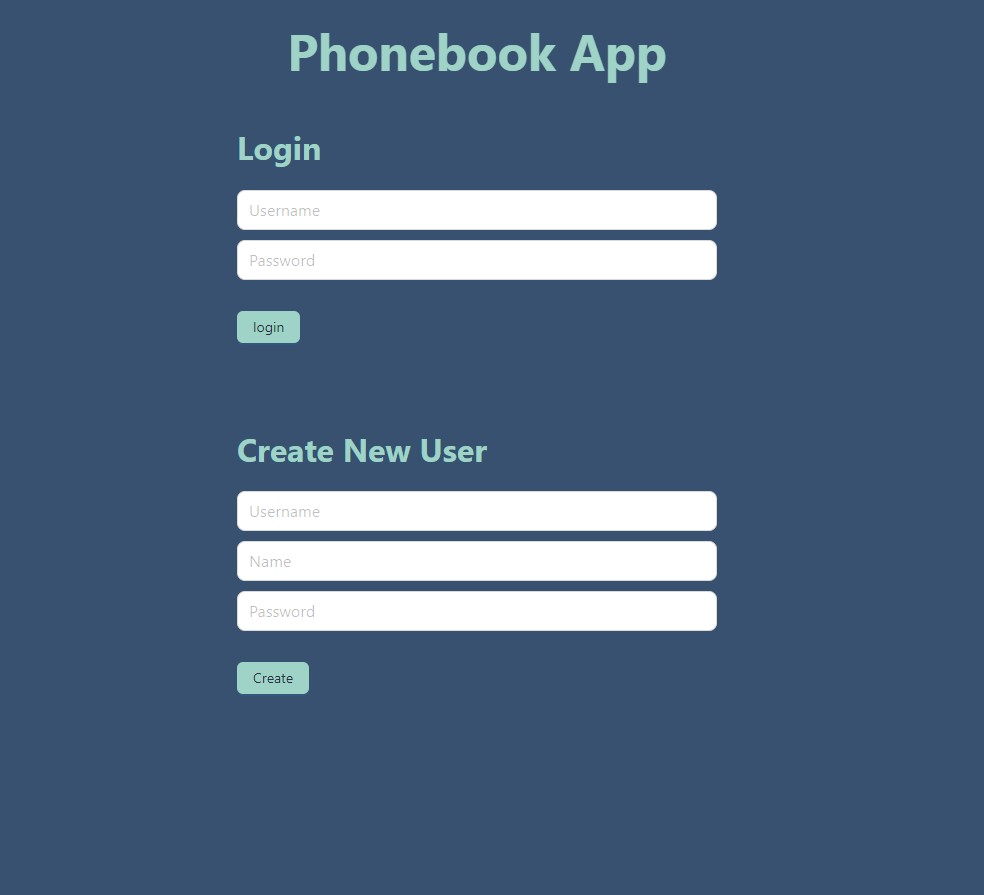
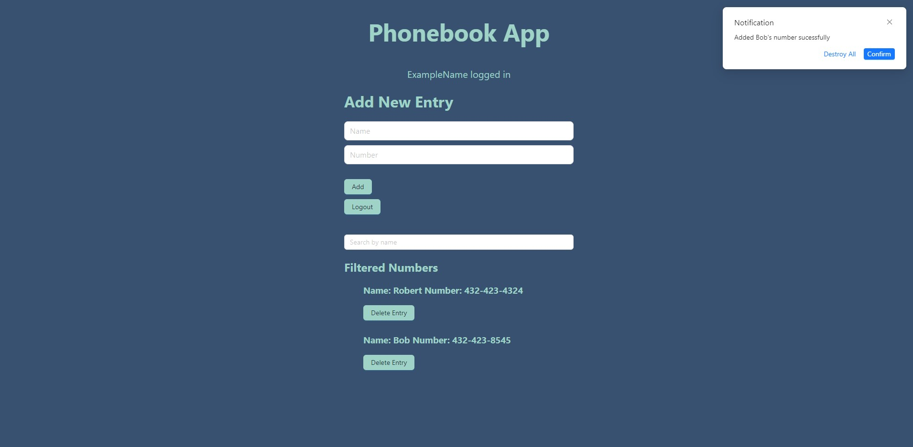
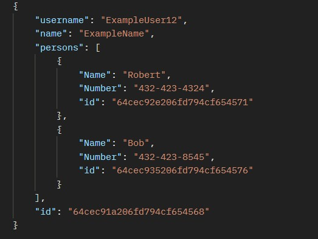

# PhoneBook Web App Project

Basic CRUD app using the MERN (Mongo DB, Express, React, Node) stack. This app implements RESTful APIs for user authentication using open-source security libraries combined with Mongo DB and JSON web tokens (jwt) to allow users to create, update, and delete phonebook entries of their contacts. 

Here is the main page:

Example of a user that is logged in:

Their data stored in a JSON:

